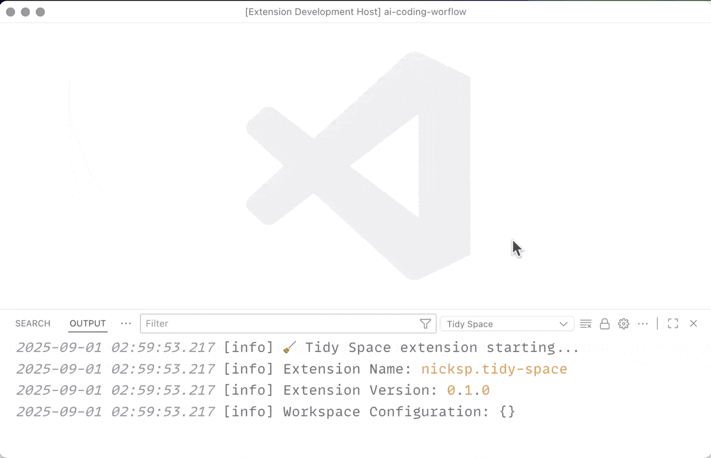
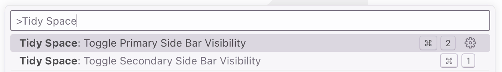

# Tidy Space

<a href="https://marketplace.visualstudio.com/items?itemName=nicksp.tidy-space" target="__blank"></a> <a href="https://open-vsx.org/extension/nicksp/tidy-space" target="__blank"></a>

Keep your workspace clutter-free: only one sidebar at a time.

**Install from [Visual Studio Marketplace](https://marketplace.visualstudio.com/items?itemName=nicksp.tidy-space) or [Open VSX Registry](https://open-vsx.org/extension/nicksp/tidy-space).**



## Features

- Keeps your editor neat: only one sidebar visible at a time.
- Optional: also hides the panel when switching.
- Almost zero config: you only control whether you want to hide the bottom panel.

## Motivation

Working on a laptop means every pixel counts. I wanted to maximize my coding area while keeping sidebars accessible when needed:

- **Limited screen real estate**: Laptop displays don't have room for multiple sidebars competing for space.
- **Focus on what matters**: Keep the code editor front and center, with sidebars appearing only when actively used.
- **Distraction-free workflow**: Automatically hide unused UI elements to maintain focus on your work.

The result is a cleaner, more focused development environment that adapts to your workflow rather than cluttering your screen.

## Commands



You can run these commands from the Command Palette (<kbd>Cmd</kbd>+<kbd>Shift</kbd>+<kbd>P</kbd> on a Mac, or <kbd>Ctrl</kbd>+<kbd>Shift</kbd>+<kbd>P</kbd> on Windows).

| Description                          | Name                                | Default Mac | Default Windows |
| ------------------------------------ | ----------------------------------- | ----------- | --------------- |
| Toggle primary side bar visibility   | `tidySpace.toggleSidebarVisibility` | —           | —               |
| Toggle secondary side bar visibility | `tidySpace.toggleAuxiliaryBar`      | —           | —               |

## Keybinding Setup

To use this extension, you need to remap your sidebar toggle keys in VS Code.

1. Open Command Palette (<kbd>Cmd</kbd>+<kbd>Shift</kbd>+<kbd>P</kbd> / <kbd>Ctrl</kbd>+<kbd>Shift</kbd>+<kbd>P</kbd>)
2. Type "Preferences: Open Keyboard Shortcuts (JSON)"
3. Add these keybindings:

```json
[
  {
    "key": "cmd+b",
    "command": "tidySpace.toggleSidebarVisibility"
  },
  {
    "key": "cmd+`",
    "command": "tidySpace.toggleAuxiliaryBar"
  }
]
```

**NOTE:** Feel free to use any key bindings you're used to.

**Windows users**: Replace <kbd>cmd</kbd> with <kbd>ctrl</kbd>.

Now when you press <kbd>Cmd</kbd>+<kbd>B</kbd> or <kbd>Cmd</kbd>+<kbd>`</kbd>, only one sidebar will be open at a time.

## Settings

You can change the following options in the [Visual Studio Code settings](https://code.visualstudio.com/docs/configure/settings).

| Description                                         | Setting                                                        | Default |
| --------------------------------------------------- | -------------------------------------------------------------- | ------- |
| Also close the bottom panel when switching sidebars | [tidySpace.closePanel](vscode://settings/tidySpace.closePanel) | `false` |

## Changelog

The changelog can be found in [CHANGELOG.md](CHANGELOG.md).

## You May Also Like

Check out my other Visual Studio Code extensions:

- [Reveal on GitHub](https://marketplace.visualstudio.com/items?itemName=nicksp.reveal-on-github) — open the current project or file on GitHub
- [Notelets](https://marketplace.visualstudio.com/items?itemName=nicksp.notelets) — add sticky notes to any file in your workspace

## Contributing

Bug fixes are welcome, but not new features. Read our [contributing guidelines](CONTRIBUTING.md) to learn more.

[Open an issue](https://github.com/nicksp/vscode-tidy-space/issues) on GitHub and [submit a pull request](https://github.com/nicksp/vscode-tidy-space/pulls).

## Authors and License

[Nick Plekhanov](https://plekhanov.me) and [contributors](https://github.com/nicksp/vscode-tidy-space/graphs/contributors).

[Icon by Creative Squad](https://www.freepik.com/search).

[MIT License](LICENSE.md).
